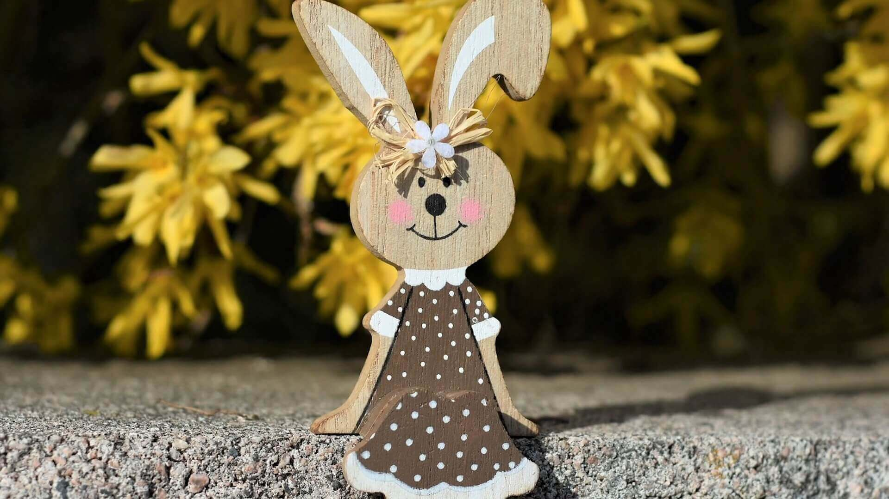

---
tags:
  - personaggio
---
# Donatella

|                        |                         |
| ---------------------- | ----------------------- |
| **Interpretato da**    | Immagini Stock Gratuite |
| **Prima apparizione**  | [[Puntata 004]]         |
| **Ultima apparizione** | [[Puntata 004]]         |
| **Numero apparizioni** | 1                       |

---
## Descrizione
Donatella è una **lepre**. Protagonista del racconto [[La storia di Donatella]].

Viene introdotta come una "**lepre shabby chic**" che vive su una mensola in una casa interamente arredata in tale stile dalla sua padrona, [[Mary Angel]].

Donatella **odia profondamente lo stile shabby chic** e sogna di diventare una "**lepre moderna**". Il suo malessere è tale che dichiara di voler "darsi fuoco" pur di cambiare vita.
##### La trasformazione
Sotto consiglio di [[Brittany]], si reca dalla [[Fata Fabrizia]], una specializzanda in chirurgia plastica, che accetta di trasformarla in lepre moderna al prezzo dell'invecchiamento immediato di 10 anni della sua padrona.

![[donatella_2.jpg]]

---
## Apparizioni

| Puntata         | Data       | Contesto                                             |
| --------------- | ---------- | ---------------------------------------------------- |
| [[Puntata 004]] | 03/04/2020 | Protagonista del racconto [[La storia di Donatella]] |

