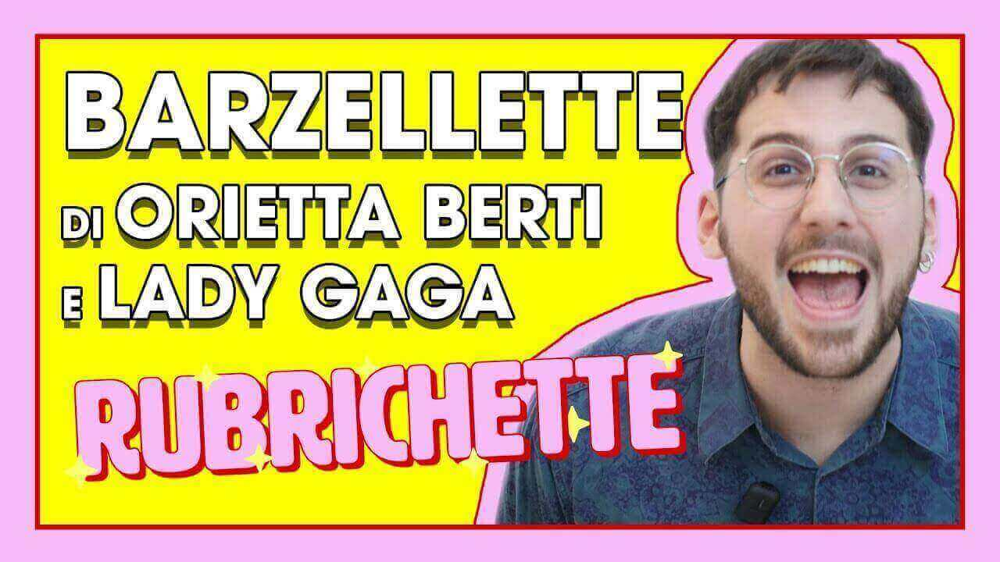

---
tags:
  - puntata
numero: "001"
data: 2020-03-13
link: https://youtu.be/zZFsHUcCd5k
durata: 03:58
---
# BARZELLETTE sul Coronavirus di LADY GAGA e ORIETTA BERTI

|                    |                                                   |
| ------------------ | ------------------------------------------------- |
| **Numero**         | 001                                               |
| **Data**           | 13/03/2020                                        |
| **Link**           | [Guarda su YouTube](https://youtu.be/zZFsHUcCd5k) |
| **Durata**         | 03:58                                             |
| Puntata Precedente | -                                                 |
| Puntata Successiva | [[Puntata 002]]                                   |

---

## Descrizione
> Benvenut* alla prima puntata di [#Rubrichette](https://www.youtube.com/hashtag/rubrichette)✨ Uno show che non promette nulla e che quindi non può deludere le tue aspettative! 
> A proposito di aspettative questo video migliorerà la tua vita del 200%! Commenta , iscriviti, fai un salto, fanne un altro e non dimenticare di dare un bacio a chi vuoi tu!

---

## Benvenuti a Rubrichette…
> *"Il primo show autoprodotto direttamente dagli studi Of My Home (de casa mia)"* ([[Of My Home Productions]])

---
## Prima Puntata
Rispetto ai classici programmi televisivi come _Pomeriggio 5_ o _Verissimo_, **Rubrichette** si distingue per le seguenti caratteristiche:

- **Produzione indipendente:** È il primo show autoprodotto direttamente dagli studi **"Of My Home"** (ovvero la casa del conduttore).
- **Budget e contenuti:** Edoardo Zaggia lo definisce un programma **"povero di budget ma ricco di contenuti"**.
- **Identità e target:** Lo show si presenta come **"totalmente gestito dalla lobby gay"**, dichiarando di non essere adatto ai bambini, a meno che non siano "bambini gay".
- **Originalità:** Viene descritto come un format **"nuovo" e "diverso"** che punta a riscoprire i "vecchi piaceri del passato" attraverso un'estetica e un linguaggio ironico e satirico.

---
## Sigla

![[ep001.mp4]]

---

## Rubriche

### 1. Le Barzellette Di Mio Nonno
Rubrica dedicata all'interpretazione di **barzellette e freddure** selezionate dalla redazione per intrattenere il pubblico annoiato a casa.

![[Assets/rubriche/ep001/ep001_1.jpg]]
#### Collegamento
La rubrica viene introdotta come un modo per riscoprire i vecchi piaceri del passato in un periodo in cui le persone passano molto tempo chiuse in casa.
#### Riassunto del contenuto
Edoardo Zaggia legge e interpreta barzellette recuperate online e dal sito (sponsor) barzellettetoste.it. Il contenuto spazia da freddure brevi (come quella su Adamo ed Eva o sullo sputo che "saliva" le scale) a tentativi di leggere storie più lunghe e situazionali, spesso interrotte perché ritenute troppo prolisse.
#### Curiosità, personaggi e ospiti speciali
- **Ospiti**: Partecipano Orietta Berti (che ringrazia Fabio Fazio e si dichiara fan di Pippo Franco) e Lady Gaga.
- **Personaggi** citati: Entrambe le ospiti elogiano Pippo Franco, definito da Lady Gaga come un "sex symbol internazionali".
- **Curiosità**: Viene proposta una freddura a tema sulla stessa ospite: "Cosa fa in bagno Lady? Gaga".
### 2. Omofobia Portami Via
È una sezione *fissa* del programma dedicata al **commento di notizie omofobe** selezionate accuratamente dalla redazione per analizzare il pensiero di quelli che il conduttore definisce "i peggiori individui"

![[Assets/rubriche/ep001/ep001_2.jpg]]
#### Collegamento
Edoardo Zaggia introduce la rubrica come un modo per entrare nella mente degli omofobi, facendo un paragone ironico con le "mamme pancine" prima di rivelare il vero tema.
#### Riassunto del contenuto
In questa puntata viene commentata una notizia dal sito gay.it riguardante il politico Pillon. 
Pillon accusa il governo di voler imporre un "diktat omosessualista" approfittando della distrazione del paese a causa del coronavirus. Zaggia risponde ironicamente suggerendo che a Pillon manchi l'aria per essere rimasto troppo chiuso in casa.
#### Curiosità e chiusura
- **Curiosità**: Il conduttore lancia una domanda provocatoria al pubblico, chiedendo se si sentano "più diktat o più gender"
- **Chiusura**: La rubrica si conclude con un saluto ironico agli omofobi, definiti come persone "sempre nel 1800
### 3. La Zodiaca (Horror-Oscopo)
È la parte finale dello show dedicata alle **previsioni astrologiche** per alcuni segni zodiacali, interpretate con l'ironia tipica del conduttore.

![[Assets/rubriche/ep001/ep001_3.jpg]]
#### Collegamento
Viene introdotta come l'ultimo momento del programma prima dei saluti finali, con la frase: "Prima di salutarci scopriamo cos’hanno in serbo per noi le stelle".
#### Riassunto del contenuto
Le stelle danno consigli molto specifici e bizzarri:
- **Pesci**: Viene ricordato che una Viennetta dimenticata in freezer da tre mesi e mezzo scadrà questo venerdì.
- **Capricorno**: Per chi cerca nuove esperienze, il consiglio astrale è di provare la Viennetta.
- **Sagittario**: A causa della troppa golosità del periodo, le stelle prescrivono una dieta.
#### Personaggi
A presidiare la rubrica è l'enigmatica figura de' [[La Zodiaca]]

---

## Personaggi apparsi
- Orietta Berti
- Lady Gaga
- [[La Zodiaca]]

---

## Cliffhanger finale
Bon, grazie di essere stati con noi...
> *"io vi aspetto qui per la prossima puntata di Rubrichette in cui scopriremo insieme come si taglia le unghie Licia Colò."*

![[fine.jpg]]