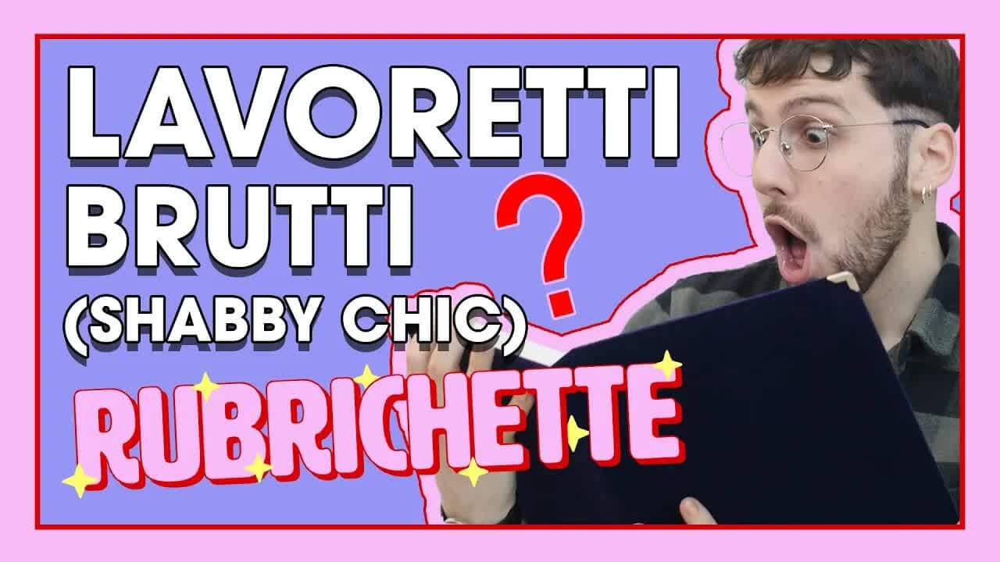

---
tags:
  - puntata
numero: "004"
data: 2020-04-03
link: https://youtu.be/5syX2o2ZciU
durata: 05:19
---
# LAVORETTI BRUTTI e storia di DONATELLA

|                    |                                                   |
| ------------------ | ------------------------------------------------- |
| **Numero**         | 004                                               |
| **Data**           | 03/04/2020                                        |
| **Link**           | [Guarda su YouTube](https://youtu.be/5syX2o2ZciU) |
| **Durata**         | 05:19                                             |
| Puntata Precedente | [[Puntata 003]]                                   |
| Puntata Successiva |                                                   |

---
## Descrizione
> Benvenut* alla nuova puntata di [#Rubrichette](https://www.youtube.com/hashtag/rubrichette)✨! L’unico show per cui abbiamo aperto una raccolta fondi, ma non ha donato nessuno. 
> Stai molto tempo a casa e vorresti rinfrescare l’arredamento? Vuoi leggere una storia per adulti (adatta anche ai bambini)? In generale ti domandi ogni giorno: “Cosa fare quando non sai cosa fare?” Questo è il video perfetto per te!

---
## Benvenuti a Rubrichette…
> *L'unico show allegretto ma non troppo un po come Tonio Cartonio l'11 settembre... Oh! Accipigna!*

---
## Sigla

![[ep004.mp4]]

---
## Rubriche

### 1. Storia di Donatella (Una storia con immagini stock gratuite)
Si tratta di una **favola moderna** raccontata attraverso l'utilizzo di immagini stock gratuite, che narra le vicissitudini di una lepre stanca dello stile di vita imposto dalla sua padrona

![[Assets/rubriche/ep004/ep004_1.jpg]]

#### Collegamento
Edoardo Zaggia introduce la rubrica spiegando che, a causa della **spossatezza del cambio di stagione** che costringe a stare in casa, lo show vuole far "viaggiare con la fantasia" il suo pubblico riscoprendo il piacere delle favole
#### Riassunto del contenuto
La rubrica narra la prima parte della fiaba [[La storia di Donatella]]

---
### 2. Momentino Lavoretti
Una sezione dedicata al **fai-da-te (DIY) parodistico**, dove oggetti di uso comune vengono trasformati in elementi d'arredo in stile **shabby chic** attraverso procedure assurde.

![[Assets/rubriche/ep004/ep004_2.jpg]]
#### Collegamento
La rubrica nasce come ispirazione diretta dalla **storia della lepre Donatella**; il conduttore invita il pubblico a scoprire come rendere la propria casa più "shabby" proprio come quella della protagonista della favola
#### Riassunto del contenuto
Vengono presentati quattro tutorial:
1. **Porta vivande:** Decorazione dei manici con **spago da cucina** utilizzando il "nodo alla danese" e il "nodo alla giuliani".
2. **Carta d'identità:** Inserita in una cornice di vetro "professional" per essere utilizzata come una **pochette**.
3. **Olio di qualità:** Travasato in un **boccettino contagocce** con etichetta vintage per essere confuso con l'acido ialuronico.
4. **Tagliere:** Trattato con **caffè, farina e olio** per far risaltare le venature del legno e decorato con fiori secchi.
Per il tutorial completo, vedi: [[Momentino Lavoretti]]

![[Assets/screenshot/ep004/ep004_2.jpg]]
#### Personaggi
Partecipa per la prima volta **[[Clarissa]]**, definita la "**modella mani più gettonata del varesotto**", che presta le mani per le dimostrazioni pratiche.
#### Curiosità
Durante la creazione viene dato l'ironico avvertimento di **non tagliarsi le dita**. Inoltre, per le etichette dell'olio, si raccomanda l'uso della calligrafia "più sciabica" possibile.

---
### 3. Storia di Donatella Parte 2 (Una storia con immagini stock gratuite)
[[Donatella]], disperata per la sua vita "shabby chic", decide di ricorrere alla magia per trasformarsi in una lepre moderna, scoprendo però che ogni desiderio ha un prezzo terribile

![[Assets/rubriche/ep004/ep004_3.jpg]]
#### Collegamento
Il conduttore riprende la narrazione dopo il segmento dei lavoretti chiedendosi: "Ma come starà passando Donatella leprotto shabby chic?
#### Riassunto del contenuto
La rubrica narra la seconda parte della fiaba [[La storia di Donatella]]

---
## Personaggi apparsi
- [[Clarissa]]

---
## Cliffhanger finale
> *"Noi ci vediamo sempre qui settimana prossima in cui scopriremo assieme come mai le zucchine si chiamano zucchine ma i cetrioli non si chiamano angurine"*

![[fine.jpg]]
