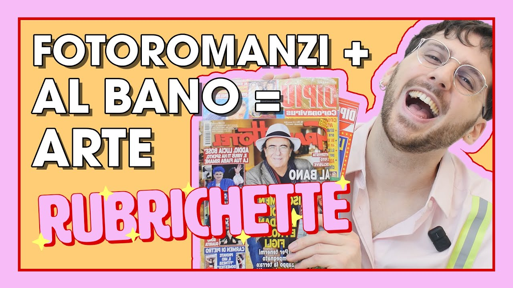

---
tags:
  - puntata
numero: "006"
data: 2020-04-17
link: https://youtu.be/lEunNxveCt8
durata: 06:19
---
# FOTOROMANZI: CHE PASSIONE!

|                    |                                                   |
| ------------------ | ------------------------------------------------- |
| **Numero**         | 006                                               |
| **Data**           | 17/04/2020                                        |
| **Link**           | [Guarda su YouTube](https://youtu.be/lEunNxveCt8) |
| **Durata**         | 06:19                                             |
| Puntata Precedente | [[Puntata 005]]                                   |
| Puntata Successiva |                                                   |

---
## Descrizione
> Benvenut* alla nuova puntata di [#Rubrichette](https://www.youtube.com/hashtag/rubrichette)✨! 
> L’unico show che non viene criticato dai poteri forti perché non sanno che esiste. 
> Senti il bisogno di capire l’arte contemporanea ? Vuoi entrare a far parte della storia dell'arte contemporanea ? Lanci il reggiseno sul palco ai concerti di Al Bano? Questo è il video che fa per te! 
> Inoltre se le tue amicizie considerano l’ arte moderna stupida o l’ arte moderna difficile manda loro questo video. Qui parliamo di arte contemporanea, ma loro sono ignoranti e non capiranno. Tra fotoromanzi del settimanale “Grand Hotel” e gattini questo video ti migliorerà la giornata del 12% !

---
## Benvenuti a Rubrichette…
> *"L'unico shampoo il presentatore non ha studiato edizione ma ha studiato i capoluoghi della Lombardia"*
> 
> ![[Assets/screenshot/ep006/ep006_1.jpg]]

---
## Sigla

![[ep006.mp4]]

---
## Rubriche

### 1. Emanando ARTE
Una sezione che propone tre semplici metodi casalinghi per "nutrire l'anima" attraverso l'espressione artistica durante il periodo di isolamento.

![[Assets/rubriche/ep006/ep006_1.jpg]]

#### Collegamento
Il conduttore introduce il segmento spiegando che, in un momento così difficile come la quarantena, al pubblico di _Rubrichette_ manca molto poter godere dell'**arte contemporanea**.
#### Riassunto del contenuto
##### 1. Ode al tagliaerba del mattino
_Onde sonore su vicinato_
Uscire sul balcone ed emanare un **urlo catartico**: *"Io non vi amo*

![[Assets/screenshot/ep006/ep006_2.jpg]]
##### 2. Ho una zia che sta a Forlì
_Strutto su calcestruzzo_
Fissare al muro il vero "nutrimento dell'anima": una piadina.

![[Assets/screenshot/ep006/ep006_3.jpg]]
_Si riconoscono dalla camicia in flanella, le mani di [[Clarissa]]_
##### 3. Per Pippo
_Sostanze chimiche su peluria_
Disegnare il volto del comico **Pippo Franco** utilizzando la **crema depilatoria**.

![[Assets/screenshot/ep006/ep006_4.jpg]]
_Anche qui, dalla camicia in flanella, si riconoscono le mani, e forse le gambe, della modella mani [[Clarissa]]_

---
### 2. Rassegna Stampa
Un'analisi satirica e dettagliata della rivista **Grand Hotel** (numero del 27 marzo 2020), definita ironicamente come una "scorpacciata" di cultura che spazia dal gossip ai fotoromanzi.

![[Assets/rubriche/ep006/ep006_2.jpg]]
#### Collegamento
Il conduttore introduce la rubrica subito dopo "Emanando ARTE", dichiarando che l'impegno culturale dello show non si ferma e presentando la rivista come uno strumento per approfondire il "settore Albano Carrisi".

![[Assets/screenshot/ep006/ep006_5.jpg]]
#### Riassunto del contenuto
##### Copertina e Gossip
Viene commentato l'isolamento di Al Bano con Loredana Lecciso (dedito a zappare la terra e a scrivere inni contro il virus), il fioretto alla Madonna di Gerry Scotti e le preghiere di Papa Francesco.
##### Fotoromanzi
Edoardo analizza le trame assurde di diverse storie, tra cui "Cuore d'acciaio" (storia di Anna, una maratoneta che deve rinunciare alle Olimpiadi di Tokyo 2020 dopo quattro bypass coronarici) e un fotoromanzo noir con protagonisti Alessia, Fulvio e Pino, incentrato su storie di droga e gioielli di famiglia venduti.
##### Rubriche minori
Vengono citate la sezione cucina (pasta tonno e cipolle) e il santo del giorno (Sant'Ugo).
#### Curiosità, personaggi e contenuti speciali
- Personaggi famosi: Al Bano Carrisi, Loredana Lecciso, Gerry Scotti e Papa Francesco.
- Personaggi dei fotoromanzi: Anna, Berardo (l'allenatore), Roberta (la moglie judoka), Christian e lo spacciatore interpretato da Lucio Motta.
- Curiosità: Il conduttore ironizza sull'ambientazione di un fotoromanzo a Kyoto, che in realtà sembra un semplice giardino con piastrelle comuni, e nota la strana posizione fetale (con le scarpe sul letto) del personaggio Fulvio.
- Prezzo: Viene specificato che la rivista costa 1,80 euro al supermercato, ma il prezzo sale a 4,60 euro all'estero.

---
### 3. MESSAGGIO subliminale
È la sezione conclusiva della puntata, presentata come una rubrica obbligatoria non dipendente dalla volontà del conduttore.

![[Assets/rubriche/ep006/ep006_3.jpg]]
#### Collegamento
Viene introdotta alla fine dello show, subito dopo la rassegna stampa di _Grand Hotel_ e poco prima dei saluti finali.
#### Riassunto del contenuto
![[Assets/screenshot/ep006/ep006_6.jpg]]

---
## Personaggi apparsi
- [[Clarissa]]
- Pippo Franco
- Albano Carrisi
- Papa Francesco

---
## Cliffhanger finale
> *"Ci vediamo se per cui settimana prossima per scoprire assieme la ricetta della pizza cachi e pinoli di Albano Carrisi"*

![[fine.jpg]]
