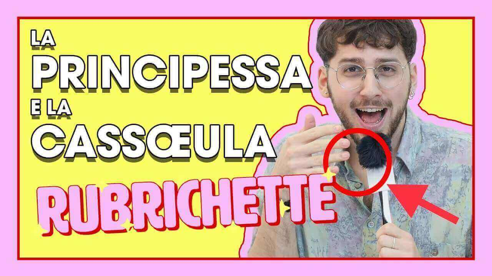

---
tags:
  - puntata
numero: "007"
data: 2020-04-24
link: https://youtu.be/H0Gq16zit5s
durata: 07:42
---
# # SCOPRO CHE PRINCIPESSA DISNEY SONO + il SEGRETO della Cassœula ASMR

|                    |                                                   |
| ------------------ | ------------------------------------------------- |
| **Numero**         | 007                                               |
| **Data**           | 24/04/2020                                        |
| **Link**           | [Guarda su YouTube](https://youtu.be/H0Gq16zit5s) |
| **Durata**         | 07:42                                             |
| Puntata Precedente | [[Puntata 006]]                                   |
| Puntata Successiva |                                                   |

---
## Descrizione
> Benvenut* alla nuova puntata di [#Rubrichette](https://www.youtube.com/hashtag/rubrichette)✨! 
> 
> L’unico show in cui la mamma di Bambi non muore. 
> 
> Cerchi assiduamente nell’inter-web: “test che principessa Disney sei”? Ti manca la cassœula della nonna? Per dormire ascolti solamente video rilassanti ASMR? Questo è il video che fa per te!
> 
> Condividilo con amici e parenti per non essere invitat* alla reunion di famiglia after quarantena!

---
## Benvenuti a Rubrichette…
> *"L'unico show che fa concorrenza alle messe in diretta dei preti... ♫ Alleluia 👏👏"*

---
## Sigla

![[ep007.mp4]]

---
## Rubriche

### 1. Via di TEST
È il segmento di apertura in cui il conduttore si sottopone a vari **test di personalità online** per "riscoprire la propria identità", andata persa durante il periodo di isolamento.

![[Assets/rubriche/ep007/ep007_1.jpg]]

#### Collegamento
Edoardo Zaggia introduce la rubrica spiegando che in questo periodo è facile dimenticare chi siamo, e per fortuna esistono i test dell'internet scelti dalla "redazione di Rubrichette" per fare chiarezza.
#### Riassunto del contenuto
- **Primo Test ("Quanto siamo brutte"):** Svolto sul sito _maryalpersonality.com_. Edoardo risponde a domande sull'altezza ("normale"), sulla bellezza (si definisce "molto bella") e sulla forma del viso ("angolare"). Il risultato lo descrive come una **donna con tanto umorismo** che fa splendere il sole quando sorride.
- **Secondo Test ("Quale principessa Disney sei"):** Svolto su _nostrofiglio.it_. Nonostante i numerosi pop-up, risponde a domande su abiti (smeraldo) e giri romantici (in gondola), risultando essere la principessa **Jasmine**. Il profilo descrive un bisogno di affermarsi al di là del proprio ruolo ufficiale.
#### Curiosità
Durante il primo test, Edoardo ironizza sulla foto del profilo finale notando che lui e la ragazza nell'immagine hanno probabilmente la "stessa quantità di denti". Nel secondo test, esprime il desiderio di essere una **"principessa shabby chic"**.

---
### 2. rilASMRassiamoci (_*non è un presidio medico chirurgico_)
Si tratta di un segmento che parodia i video di **ASMR**, dove il conduttore cerca di rilassare il pubblico aprendo piccoli gadget e sussurrando la ricetta di un piatto tipico lombardo.

![[Assets/rubriche/ep007/ep007_2.jpg]]
#### Collegamento
Edoardo spiega che restare in contatto con se stessi durante l'isolamento può essere difficile e **stressante**, quindi lo show propone questa rubrica come una "soluzione" per rilassarsi.
#### Riassunto del contenuto
Il conduttore apre e mangia una caramellina.

Poi si dedica all'umboxing di una sorpresina Esselunga in cui trova una piccola statuina che rffigura Antonella Elia Umbridge.

Successivamente sgranocchia una [[Gallettozza]] _(No ADV)_.

Inizia poi a sussurrare in stile ASMR la ricetta della Cassœula, elencando ingredienti crudi come costine, cotenna, piedino e 350 grammi di orecchio di suino.

La narrazione degenera in un racconto surreale che mescola i ricordi di una nonna che uccideva i conigli con il coltello e una finta cena passata in carcere a causa di un incidente con l'auto aziendale non assicurata.

![[Assets/screenshot/ep007/ep007_1.jpg]]

---
### 3. Indovinello Bello
Si tratta di un segmento lampo incentrato su un **indovinello** volto a "**tenere allenato il cervello**" degli spettatori in chiusura di puntata.

![[Assets/rubriche/ep007/ep007_3.jpg]]
#### Collegamento
Viene introdotta verso la fine dello show, subito dopo la rubrica ASMR, come ultimo contenuto ludico prima dei saluti.
#### Riassunto del contenuto
L'indovinello proposto è: 

> **"si vede ma non si può toccare"**. 

La risposta fornita dal conduttore è 

>**"il patriarcato"**.

---
## Cliffhanger finale
> *"noi ci vediamo sempre qui settimana prossima per rispondere alla seguente domanda: dato che una lumaca sbava dappertutto, è educato e sputarle sopra?"*

![[fine.jpg]]
