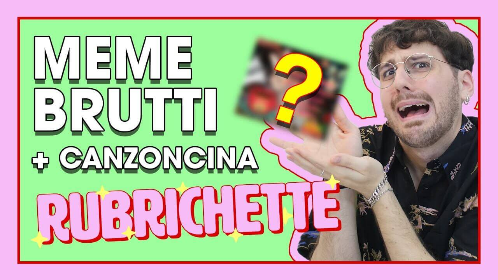

---
tags:
  - puntata
numero: "008"
data: 2020-05-01
link: https://youtu.be/eil1uzuFWq4
durata: 06:58
---
# MEME BRUTTI del BUONGIORNO sul CORONAVIRUS: Tutorial + Canzoncina

|                    |                                                   |
| ------------------ | ------------------------------------------------- |
| **Numero**         | 008                                               |
| **Data**           | 01/05/2020                                        |
| **Link**           | [Guarda su YouTube](https://youtu.be/eil1uzuFWq4) |
| **Durata**         | 06:58                                             |
| Puntata Precedente | [[Puntata 007]]                                   |
| Puntata Successiva | [[Puntata 009]]                                   |

---
## Descrizione
> Benvenut* alla nuova puntata di [#Rubrichette](https://www.youtube.com/hashtag/rubrichette)✨! 
> 
> L’unico programma youtube lgbt in italia! (non controllate le fonti plz)
> 
> Ti svegli la mattina sperando di ricevere numerosi meme del buongiorno dalle tue zie preferite? Nell’ultimo periodo ricevi anche meme sul coronavirus? Sei stanc*? In questo video creo un meme brutto per darti gli strumenti di rispondere a tono ai “Buongiornissimo! kaffè?!” Senti anche il bisogno di una canzone brutta che parli di cosa sia giusto fare in questo momento? Eccoti acccontentat*! 
> 
> Scarica qui il meme più croccante di tutti: [https://drive.google.com/open?id=1oSW...](https://www.youtube.com/redirect?event=video_description&redir_token=QUFFLUhqbGEzT3BNZk5adnU0QWgxTlA5NGY4a3NBR0tqZ3xBQ3Jtc0tsbFFucm5qUFFrQVJ2Q2VtN2JaZHRKcGtuejB2RFpLQW84eERfQ3hoZXpTVWlHcWZrUExTTEpLd2RlMlZMSEMwMnVrdlNMNG9jNENLMzRoRmVWajR5Zl9Sdy1xRjV0cjVrUEl5dDNZMHM2LUFkVGdQbw&q=https%3A%2F%2Fdrive.google.com%2Fopen%3Fid%3D1oSWSqHA7WNp2uMcH9Ax60qlGkOqvHBd_&v=eil1uzuFWq4)
> 
> ![[BUONGIORNISSIMISSIMO.png]]

---
## Benvenuti a Rubrichette…
> *"L'unico shock e alle elementari ti picchiava perché giocavi con le Barbie; alle medie aveva il baffetto modesto; alle superiori ha messo su massa e ti faceva bagnare le mutandine e all'università ha messo incinta e sua cugina, problema risolto!"*

---
## Sigla

![[ep008.mp4]]

---
## Pronuncia ufficiale
In questa puntata la produzione tutta di Rubrichette specifica che la pronuncia ufficiale scelta per dire "meme" è:

> _Mèmè_

---
## Rubriche

### 1. Che Buongiorno di MEMErda!
Una rubrica dedicata all'analisi dei **meme "brutti"** del buongiorno che circolano sui social e su WhatsApp, culminante in un tutorial per crearne uno personalizzato,.

![[Assets/rubriche/ep008/ep008_1.jpg]]

#### Collegamento
Il conduttore introduce il segmento spiegando che, nonostante il periodo difficile della pandemia, c'è un settore dell'intrattenimento che non si è mai fermato: quello dei **meme brutti**.
#### Riassunto del contenuto
Viene analizzata la natura di queste "immagini demoniache" provenienti spesso dal **gruppo WhatsApp di famiglia**: _"I Burloni"_.

![[Assets/screenshot/ep008/ep008_1.jpg]]
#### Analisi meme per meme:
##### Snoopy:
Definito un classico dei gruppi WhatsApp di famiglia, è caratterizzato da scritte "buongiorno" ridondanti, cuori in 3D e sticker di Facebook che esprimono la mancanza di abbracci, baci o messaggi.

![[Assets/screenshot/ep008/ep008_2.jpg]]
##### Il cagnolino: 
Proviene dal sito paper.com.

Riporta la frase: "Il cuore l'unica zona rossa del mare". Viene criticato per il tentativo forzato di unire il tema della pandemia (zona rossa) con i classici auguri del mattino.

![[Assets/screenshot/ep008/ep008_3.jpg]]
##### Le signore del caffè: 
Individuato sulla storia WhatsApp (profilo di Angela), mostra una signora che versa il caffè a un'altra. Ha vinto il premio "miglior grafica pulita" per il suo stile semplice, elegante e privo di troppi elementi grafici disturbanti.

![[Assets/screenshot/ep008/ep008_4.jpg]]
##### Il caffè "beato lui": 
Basato su una foto reale, presenta la scritta: "buongiorno il caffè sta uscendo beato lui", dove il "beato lui" ironizza sull'impossibilità delle persone di uscire di casa. Contiene il watermark della pagina "Il sorriso della fata".

![[Assets/screenshot/ep008/ep008_5.jpg]]
##### Mani giganti: 
Descritta come una vera "opera d'arte", raffigura mani enormi che escono dai palazzi per versare il caffè in una tazzina. La scritta "buongiorno" viene ripetuta ossessivamente più volte fino a sera.
Il meme è voluto direttamente dalla lobby dei meme del buongiornissimo per mantere il livello qualitativo adeguatamente basso.

![[Assets/screenshot/ep008/ep008_6.jpg]]
#### Fornitori ufficiali
Vengono ringraziati ironicamente il gruppo WhatsApp **"I Burloni"** e la **zia Anna**, definita "il dito più veloce del West".

---
### 2. Tutorialino Memino Bruttino
Un **tutorial creativo** condotto sul sito Canva per progettare da zero un "meme del buongiorno" che rispetti tutti i canoni estetici dei meme peggiori del web.

![[Assets/rubriche/ep008/ep008_2.jpg]]
#### Collegamento
Il conduttore introduce il segmento affermando che, dopo aver analizzato i meme altrui, lo show non vuole comportarsi da "sciacallo" ma desidera **"dare al mondo dei meme brutti"** un proprio contributo originale.
#### Riassunto del contenuto
- **Strumenti:** Utilizzo di **Canva** con formato specifico per Facebook.
- **Composizione visiva:** Come sfondo vengono inserite la lepre **[[Donatella]]** e la **[[Fata Fabrizia]]**.
- **Testo e Font:** Viene scelta la frase _"buongiorno dal virus più buono che si possa diffondere: il caffè"_ utilizzando il font **"Adigiana Toybox"** in colore giallo.
- **Effetto Speciale:** Il cosiddetto **"Effetto Tumblr"**, ottenuto duplicando il testo e sovrapponendolo a caso.
- **Elementi grafici:** Aggiunta di cuori, gattini, stelle e una **moka classica** posizionata tra numerose rose (sei boccioli più uno regalato alla fata).
- **Chiusura:** Il meme viene firmato con il watermark _"I dolci pensieri di Fata Fabrizia"_.

Il tutorial completo e dettagliato è disponibile a [[Tutorialino Memino Bruttino]]
#### Curiosità, personaggi e interazione
- **Curiosità tecniche:** Viene scartata la "moka degli alpini" perché non era correttamente scontornata.
- **Personaggi:** Vengono inserite nella composizione [[Donatella]], [[Fata Fabrizia]] e [[Mary Angel]]
- **Interazione:** Il meme finale è stato reso disponibile per il **download** nella descrizione del video affinché gli spettatori potessero inviarlo ad amici e parenti. ([[Puntata 008#Descrizione]])

---
### 3. Radio Rubrichette (ALZA IL VOLUME)
Un **momento canoro** parodistico e "totalmente disinteressato" creato per spingere gli spettatori a iscriversi al canale YouTube dello show.

![[Assets/rubriche/ep008/ep008_3.jpg]]
#### Collegamento
La rubrica segue immediatamente la conclusione del tutorial per il "meme brutto"; il conduttore la introduce come una richiesta speciale rivolta al pubblico.
#### Riassunto del contenuto
Si esibisce [[Young Edoardino]] cantando il suo nuovo brano pop [[OVUNQUE TU SIA]] il cui testo invita esplicitamente a cercare il link di YouTube, **iscriversi al canale** e attivare la campanella delle notifiche.
#### Curiosità, personaggi e ospiti speciali
Ad esibirsi nella performance canora del suo stesso singolo è [[Young Edoardino]]

---
## Personaggi apparsi
- [[Donatella]]
- [[Fata Fabrizia]]
- [[Mary Angel]]
- [[Young Edoardino]]

---
## Cliffhanger finale
> *"Noi ci vediamo sempre qui settimana prossima con il tutorial: come rubare la carta igienica dall'ufficio mentre siamo in smart working"*

![[fine.jpg]]
