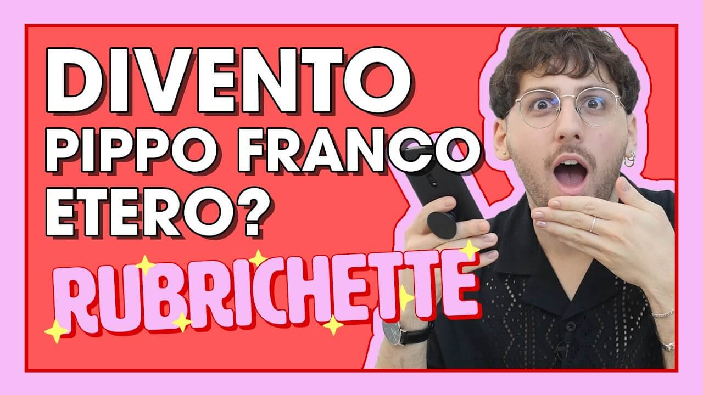

---
tags:
  - puntata
  - chirurgia-plastica
  - giornalismo
  - rassegna-stampa
  - trasformazione
  - pippo-franco
numero: "011"
data: 2020-05-22
link: https://youtu.be/7YWSD-4TY8c
durata: 10:19
title: Puntata 011 - Il SEGRETO per diventare PIPPO FRANCO e notizie molto ETEROSESSUALI
---
# Il SEGRETO per diventare PIPPO FRANCO e notizie molto ETEROSESSUALI

|                    |                                                   |
| ------------------ | ------------------------------------------------- |
| **Numero**         | 011                                               |
| **Data**           | 22/05/2020                                        |
| **Link**           | [Guarda su YouTube](https://youtu.be/7YWSD-4TY8c) |
| **Durata**         | 10:19                                             |
| Puntata Precedente | [[Puntata 010]]                                   |
| Puntata Successiva | [[Puntata 012]]]                                  |

---
## Descrizione
> Benvenut* alla nuova puntata di [#Rubrichette](https://www.youtube.com/hashtag/rubrichette)✨! 
> 
> L’unico show che si ispira al Bagaglino!
> 
> Durante questo episodio ti capiterà spesso di pensare: “questa è una di quelle notizie che non volevo sapere” ! Per rendere più speciale il giorno del mio compleanno realizzo uno dei miei sogni più grandi di sempre: mi trasformo in Pippo Franco.
> 
> Nel finale chiudiamo la puntata con delle note dolci e delicate che ci faranno viaggiare sulle ali della fantasia!

---
## Benvenuti a Rubrichette…
> *"L'unico show che è un sacco di cose in comune con i delfini: comunica con un linguaggio complesso e articolato, si guadagna da vivere facendo la sciocca davanti agli esseri umani e infine ihihihihihi"*

---
## Sigla

![[ep011.mp4]]
La sigla della puntata 011 pone l'attenzione su un elemento finora trascurato: i quadri nello sfondo. Infatti per la prima volta nella storia del programma vengono sostituiti con due meravigliose stame [della Enri](https://www.enricazaggia.com/). Il cambio dei quadri diventa un appuntamento periodico che scandisce la stagionalità del programma.

---
## Rubriche

### 1. Cos'hanno Combinato Gli Etero Stavolta? - Il TG che sa a chi dare la colpa
Una parodia di rassegna stampa/TG internazionale in cui vengono lette e commentate notizie bizzarre dal mondo, dimostrando in chiave satirica come siano tutte legate dal filo conduttore dei comportamenti tipici degli eterosessuali.

![[Assets/rubriche/ep011/ep011_1.jpg]]

#### Collegamento
Viene presentata subito dopo la sigla come l'agenzia di stampa ufficiale a cui si affidano i maggiori quotidiani italiani per riportare le notizie principali, selezionate direttamente dai media in lingua inglese.
#### Riassunto del contenuto
##### I vicini scomparsi
Una coppia di vicini etero chiede di tenere il proprio cagnolino per tre settimane, per poi sparire nel nulla e non farsi rivedere nemmeno dopo un anno

![[Assets/screenshot/ep011/ep011_1.jpg]]
*(Foto dei vicini a cui è stato affidato il cagnolino. O no?)*

##### Piedi da trincea
Un uomo indossa gli stivali ininterrottamente per 10 ore ritrovandosi con i piedi totalmente deformati ("piedi da trincea").
L'immagine del piede rievoca l'aspetto e il feeling del [[Cetry-Tronki]]

![[Assets/screenshot/ep011/ep011_2.jpg]]
*(Attenzione: Immagini Forti. Il dottore gli ha chiesto a che cadavere avesse rubato il piede "#piededatrincea")*

##### Unghie dei piedi extra lunghe
Una donna non può correre né indossare scarpe da ginnastica a causa delle sue unghie dei piedi lunghissime.

![[Assets/screenshot/ep011/ep011_3.jpg]]
(Grazie alle doti investigative del conduttore si scopre l'identità della donna grazie alle dettagliature dei piedi. Altri non è se non la modella mani più gettonata del varesotto [[Clarissa]])

##### Gaffe sui dinosauri
Gli errori commessi dagli scienziati nella determinazione del sesso e del genere dei fossili di dinosauro.

##### Ruspa Jacuzzi
Un uomo stanco delle lamentele della compagna trasforma una ruspa in vasca idromassaggio usando anche un trapano per creare le bolle.

![[ep011_4.jpg]]
*(La moglie living her best life)*
#### Conclusioni
In primis, la conclusione a cui l'umanità è giunta grazie a questa rubrica è che avere o mostrare i piedi è la caratteristica principale per riconoscere una persona eterosessuale.

In secundis, chi vuole trarre le sue conclusioni le tragghi

---
### 2. Sarò Pippo Sarò Franco
Edoardo si sottopone a un esperimento digitale di fotoritocco per trasformare il proprio volto in quello di Pippo Franco utilizzando l'applicazione FaceApp come autoregalo per questa puntata che va in onda il giorno del suo compleanno.

![[Assets/rubriche/ep011/ep011_2.jpg]]
#### Collegamento
[[Edoardo Zaggia]] rivela che è il giorno del suo compleanno e desidera festeggiare realizzando il suo sogno più grande: diventare identico a Pippo Franco. Spiega di stare mettendo da parte i soldi per la chirurgia plastica, ma nel frattempo decide di usare un'app di ritocco fotografico per sognare insieme al pubblico.
#### Riassunto del contenuto
- Edoardo scatta una foto nella stessa posizione e posa di una foto di riferimento di Pippo Franco.
- Attraverso FaceApp, regola vari parametri per avvicinarsi ai tratti del comico: mantiene il filtro bellezza, ingrandisce il sorriso al massimo, assottiglia la mascella e distanzia gli occhi.
- Modifica il naso per farlo assomigliare a quello di Pippo, notando un'affinità elettiva.
- Sottilizza e alza l'inclinazione della sopracciglia sinistra (tratto distintivo di Pippo) e regola il contorno delle labbra.
- Per accedere a tutti i filtri necessari non esita a pagare l'abbonamento dell'applicazione ("per Pippo pago!").
- Completa l'opera con un trucco digitale (fard) per ottenere una carnagione più abbronzata, ottenendo un risultato finale che lo fa sembrare "suo figlio".
#### Da così... a così:
La foto originale:

![[ep011_5.jpg]]

La versione pressochè identica di Edoardo:

![[ep011_6.jpg]]
#### Curiosità, personaggi e ospiti speciali
- **Pippo Franco e il nome d'arte:** Durante il fotoritocco si discute del fatto che Pippo Franco non sia il suo vero nome che è in realtà Francesco Pippo.

---
### 3. Cose Brutte Che Speravamo Non Ci Venissero In Mente
Una brevissima e frenetica rubrica di chiusura in cui il conduttore elenca una serie di immagini o situazioni spiacevoli, grottesche e negative ("cose brutte") prima di salutare il pubblico.

![[Assets/rubriche/ep011/ep011_3.jpg]]
#### Collegamento
Viene introdotta negli ultimi minuti dello show, subito dopo aver completato il fotoritocco per diventare Pippo Franco, con la frase: _"prima di salutarci abbiamo ancora tempo per una veloce rubrica di cose brutte che speravamo non ci venissero in mente"_.
#### Riassunto del contenuto
L'elenco esplicito delle "cose brutte" citate comprende:

1. I **brufoli dentro i brufoli**. ![[ep011_7.jpg]]
2. Il **gel per capelli alla maionese**. ![[ep011_8.jpg]]
3. Le **torte a forma di piedi**.  ![[ep011_9.jpg]]
4. I **piedi con la forfora**.  ![[ep011_10.jpg]]
5. La **mancanza di una legge contro l'omobitransfobia**

---
## Cliffhanger finale
> *"Ci vediamo sempre qui settimana prossima per scoprire assieme _perché la mucca fa muu ma il merlo non fa mee"*

![[fine.jpg]]
