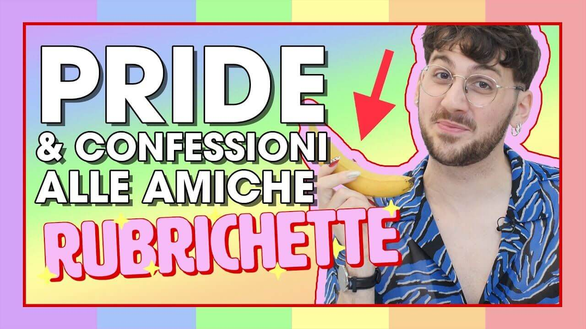

---
tags:
  - puntata
  - "#speciale-pride"
  - "#lgbtq"
  - "#Sara"
  - "#Bettina"
numero: "013"
data: 2020-06-05
link: https://youtu.be/jVwxXg0Bjt8
durata: 12:08
title: "Puntata 013 - Mese del PRIDE: lavoretti QUEER, AMICHE speciali e MONOLOGAY"
---
# Mese del PRIDE: lavoretti QUEER, AMICHE speciali e MONOLOGAY
🏳️‍🌈 Una puntata speciale per il mese del Pride #speciale-pride 

|                    |                                                   |
| ------------------ | ------------------------------------------------- |
| **Numero**         | 013                                               |
| **Data**           | 05/06/2020                                        |
| **Link**           | [Guarda su YouTube](https://youtu.be/jVwxXg0Bjt8) |
| **Durata**         | 12:08                                             |
| Puntata Precedente | [[Puntata 012]]                                   |
| Puntata Successiva | [[Puntata 014]]                                   |

---
## Descrizione
> Benvenut* alla nuova puntata di [#Rubrichette](https://www.youtube.com/hashtag/rubrichette)✨!
> 
> L’unico show lgbt di youtube italia! (non controllare le fonti) 
> 
> È finalmente il PrideMonth e regola numero uno della comunità LGBTQ+ è fare in casa lavoretti gay.> Poi in una deliziosa telefonata con le mie best friend ripercorro momenti importanti del nostro rapporto e parliamo di cosa ci mancherà quest’anno del Pride.
> 
> In chiusura un pensiero nato da una recente esperienza.

---
## Benvenuti a Rubrichette…
> *"L'unico show in cui il presentatore non desidera la donna d'altri perché quelle cose le lasciamo alle lesbiche! Vai così lesbiche! Salverete il mondo!"*

---
## Sigla

![[ep013.mp4]]

---
## Rubriche

### 1. LAVO-QUEER-ETTI
Un tutorial di bricolage fai-da-te, ambientato nel "Laboratôire Roubriquoïse", pensato per trasformare oggetti noiosi o quotidiani in accessori **queer** e stravaganti per celebrare il mese del Pride.

![[Assets/rubriche/ep013/ep013_1.jpg]]

#### Collegamento
La rubrica si apre celebrando l'inizio del **mese del Pride**. Poiché le tradizionali parate cittadine non si sono potute svolgere a causa della pandemia ("il peggiore degli omofobi"), lo show propone dei consigli pratici per portare lo spirito del Pride direttamente a casa.
#### Riassunto del contenuto
##### L'Amuqueera
L'Amuchina viene resa meno noiosa con l'aggiunta di una confezione di **glitter** al suo interno (anche se il disinfettante ne spegne la brillantezza facendola sembrare "forfora colorata").

![[Assets/screenshot/ep013/ep013_1.jpg]]
##### Ciabatta e nails
Applicazione di unghie finte adesive "da trucida" sulle dita dei piedi (o sulla ciabatta) per abbinarle alle ciabatte e far sentire il proprio arrivo sul parquet.

![[Assets/screenshot/ep013/ep013_2.jpg]]

##### Banana incisa
La buccia della banana viene incisa per raffigurare il patriarcato utilizzando le unghie finte appena applicate per poi essere mangiata con ferocia

![[Assets/screenshot/ep013/ep013_3.jpg]]
##### Martello e Cacciavite
Definiti come "baluardi dell'eterosessualità", vengono resi gay incollando sulla testa del martello (con la colla a caldo) il busto e il vestitino di una bambola principessa, creando "Martellita".

![[ep013_4.jpg]]

Il cacciavite... da così a così...

![[ep013_5.jpg]]

---
### 2. Pronto... Raffaello?
Una **telefonata a sorpresa** alle amiche Sara e Bettina per fare loro un'intervista sui ricordi, sugli aneddoti e sulle loro esperienze legate al Pride.

![[Assets/rubriche/ep013/ep013_2.jpg]]
#### Collegamento
Dopo aver realizzato i lavoretti queer, Edoardo introduce la rubrica spiegando che, essendo il mese del Pride, desidera scoprire come rendere "la vita delle sue amiche sempre più gay" e decide quindi di contattarle al telefono.
#### Riassunto del contenuto
Edoardo chiama Sara e Bettina. Chiede loro a se ricordano quando ha rivelato di essere gay; le amiche ammettono che inizialmente lo ritenevano soltanto "un maschio un po' espressivo" e che hanno provato molta gioia quando Edoardo si è confidato con loro.
##### I ricordi del Pride
Edoardo domanda come sia stata la loro prima volta al Pride e quale outfit avessero scelto. Viene ricordato in particolare l'abito di tulle indossato da Sara al suo primo pride. Si discute poi dell'abitudine di Bettina nel decorarsi il seno per la manifestazione, ricordando l'anno precedente in cui era cosparsa di glitter attaccati con la colla per le unghie (risultato pazzesco ma doloroso da levare)

---
### 3. Monologay
Un monologo toccante e ironico sul significato del Mese del Pride, sui progressi generazionali della comunità LGBTQ+ e sulla lotta contro l'omofobia.

![[Assets/rubriche/ep013/ep013_3.jpg]]
#### Collegamento
Edoardo introduce il segmento subito dopo la telefonata con le amiche, spiegando di volersi ritagliare qualche minuto prima del termine della puntata per condividere un pensiero nato navigando su TikTok.
#### Il monologo

![[ep013_6.mp4]]
#### Trascrizione
L'altro giorno ho aperto TikTok e fra un balletto un canneto ho visto una cosa sconvolgente!

C'era questo ragazzino di 18 anni al massimo e prima ancora che iniziasse a parlare mi si è attivato il gay radar. 

Ho subito pensato: "Eccolo qua, una nuova leva pronto ad entrare nell'esercito delle gays!"

Perché lo vedevo, mi ricordava me stesso alla sua età quando facevo finta mi piacesse giocare a calcio, avevo paura di mettermi le magliette rosa...
Per spostare l'attenzione prendevo in giro il compagno di scuola più effeminato di me. Ma ci pensate? Uno più effeminato di me?

Ho visto questo ragazzino su TikTok e ho pensato: "Chissà com'è essere oggi un giovanissimo gay, che sta scoprendo se stesso, magari no ha ancora detto ad amici e famiglia che gli piace il cacciavite" E lui nei TikTok va da sua madre e le dice: "Mamma che schifo, ho appena scoperto di essere nato da una coppia etero. Per fortuna non mi hanno cresciuto etero!"

Raga, applausi!

Complimenti per la battuta ma poi che sogno poter fin da subito far sentire in colpa nostra madre!

No, sto scherzando!

È un sogno vedere che una parte delle nuove generazioni sta crescendo con lo spirito giusto Lo spirito gay!

No scherzo ancora.

Intendo potere e voler parlare apertamente di come si è!

Io alla sua età non avrei avuto il coraggio. Al massimo guardavo le Olimpiadi aspettando i tuffi con un cuscino sulle gambe!

C'è ancora tantissima strada da fare perché l'omofobia è come la muffa.

Se continui a farti la doccia con la finestra chiusa si espande e ti ricopre il soffitto L'umanità fa la doccia con la finestra chiusa da sempre ma nel Giugno del '69, a Stonewall, quando qualcuno ha aperto quella finestra con un mattone abbiamo capito che è possibile farsi la doccia in un bagno senza muffa.

Ecco, è vero che la muffa si fa fatica a togliere, ma un po' alla volta abbiamo iniziato a seguire i consigli della nonna, a comprare gli spray alla candeggina, informarci sulle vernici antimuffa.
Anno dopo anno e Pride dopo Pride la muffa sta venendo via. Il problema non è ancora risolto, ma di sicuro qualcosa sta cambiando... Vedi il ragazzino su TikTok!

Insomma: il Pride è uno dei migliori antimuffa in circolazione E di sicuro quest'anno esserne privati non aiuterà il nostro povero bagno.

Ma c'è una cosa che voglio ricordare alla muffa: passata di candeggina dopo passata di candeggina Il muro sta diventando sempre più bianco. 

Anzi: arcobaleno!

---
## Cliffhanger finale
> *"Ci vediamo sempre qui settimana prossima per scoprire assieme qual è la differenza fra un gay è una teiera (Nessuna)"*

![[fine.jpg]]
