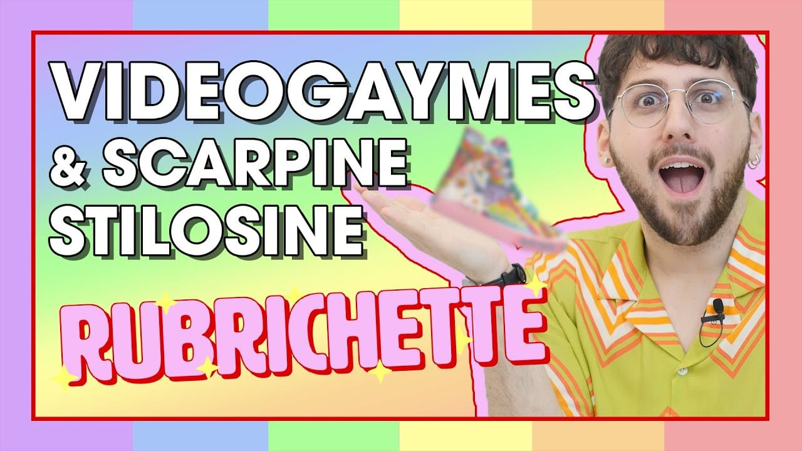

---
tags:
  - puntata
  - "#speciale-pride"
  - "#videogiochi"
  - lgbtq
  - "#lady-gaga"
  - fashion
  - "#haute-couture"
  - valeria-marini
numero: "014"
data: 2020-06-12
link: https://youtu.be/p3w6OOQB67s
durata: 12:47
title: "Puntata 014 - Mese del PRIDE: VIDEOGAYME (FAIL!) e alta moda con LELLI KELLY"
---
# # Mese del PRIDE: VIDEOGAYME (FAIL!) e alta moda con LELLI KELLY

|                    |                                                   |
| ------------------ | ------------------------------------------------- |
| **Numero**         | 014                                               |
| **Data**           | 12/06/2020                                        |
| **Link**           | [Guarda su YouTube](https://youtu.be/p3w6OOQB67s) |
| **Durata**         | 12:47                                             |
| Puntata Precedente | [[Puntata 013]]                                   |
| Puntata Successiva | [[Puntata 015]]                                   |

---
## Descrizione
> Benvenut* alla nuova puntata di [#Rubrichette](https://www.youtube.com/hashtag/rubrichette)✨!
> 
> L’unico show lgbt di Youtube Italia! (non controllare le fonti) È finalmente il Pride Month e Rubrichette vi fa giocare ai migliori videogaymes di sempre! O no?
> 
> Poi un tuffo nell’alta moda italiana con un brand conosciuto in Italia e all’estero: Lelli Kelly!🦄
> 
> In conclusione la risposta all’annosa domanda: è Lelli Kelly gay? Immancabile il paragone con la moda haute couture!

---
## Benvenuti a Rubrichette…
> *"L'unico show che al bar dell'oratorio prendeva sempre il calippo perché era gelato che costava di meno e insegnava di più!"*

---
## Sigla

![[ep014.mp4]]

---
## Rubriche

### 1. Videogaymer
Un tentativo di testare un videogioco a tematica LGBTQ+ (un presunto simulatore d'amore lesbico ambientato in spiaggia) che si rivela in realtà un gioco di incontri etero per adulti con dinamiche forzate.

![[Assets/rubriche/ep014/ep014_1.jpg]]

#### Collegamento
La rubrica viene introdotta per celebrare il Mese del Pride, con l'intento di esplorare la rappresentazione della comunità arcobaleno nel mondo dei "videogayme".

![[Assets/screenshot/ep014/ep014_1.jpg]]
#### Riassunto del contenuto
###### Creazione del personaggio
Edoardo personalizza l'avatar scegliento ricci spettinati e un abito "pesca carina" (che gli ricorda la linea _Seduzioni Diamonds_ di Valeria Marini), battezzando la protagonista **Valeria Marie**.

![[Assets/screenshot/ep014/ep014_2.jpg]]

###### La scoperta della truffa
Tra manette pelose, fruste e il capitolo "La proposta indecente", Edoardo si rende conto di essere finito in un gioco "porny" totalmente incentrato su incontri con uomini.
###### Lo svolgimento
Utilizzando una parlata con l'accento di Valeria Marini, la protagonista incontra l'amica **Brie** e va in discoteca.

![[Assets/screenshot/ep014/ep014_3.jpg]]
###### Il fallimento
Nonostante i tentativi di Edoardo di far "quagliare" la protagonista con l'amica Brie, il gioco forza continui approcci etero con uomini (tra cui un ragazzo di nome Darren che propone un video intimo).
###### Esito
Il gioco viene bocciato e dichiarato non "Rubrichette approved".
#### Riflessione Finale
Edoardo sottolinea come l'impossibilità di far valere le proprie decisioni nel gioco rispecchi la mancanza di considerazione delle scelte delle donne nella società.

Edoardo e Alberto promettono di inviare una formale lettera di doglianza agli sviluppatori nella speranza di trovare un giorno un videogioco con una storia d'amore lesbica felice.

---
### 2. Lelli Kellami Tutt*
Un'esplorazione satirica del marchio di calzature **Lelli Kelly**, celebrato in chiave comica come un'icona dell'estetica queer e camp.

![[Assets/rubriche/ep014/ep014_2.jpg]]
#### Collegamento
Viene introdotta durante il Mese del Pride come alternativa alle classiche multinazionali che si limitano a stampare magliette arcobaleno, presentando Lelli Kelly come un'eccellenza italiana che supporta da sempre l'estetica LGBTQ+.
#### Riassunto del contenuto
###### Prezzi e qualità
Edoardo ed Alberto notano i prezzi elevati delle calzature, trovandoli tuttavia giustificati dalla qualità del prodotto.
###### L'estetica Unicorn Wings
Esplorando la linea **Unicorn Wings**, Edoardo nota gli accessori a forma di unicorno smaltati e diamantati, paragonandoli per sfarzo alla linea _Seduzioni Diamonds_ di Valeria Marini.
###### Target e taglie
Viene apprezzato il fatto che il sito parli direttamente al femminile, anche se Edoardo nota con rammarico che i numeri arrivano soltanto fino al 39.
###### L'articolo "dal 1920"
Viene letto un testo presente sul sito e basato sul disegno della "principessa" fatto dalla piccola Greta. Nel testo si teorizza che i tacchi comunichino eleganza e femminilità legate alla figura materna, criticando le mamme moderne che indossano troppo spesso le _sneakers_ impoverendo il buon gusto; Edoardo commenta chiedendosi se l'articolo sia stato scritto nel 1920.
###### Spot e diffusione
Viene evidenziata la presenza del marchio su YouTube con spot tradotti in varie lingue (incluso il greco) e si immagina che a New York ci sia almeno una bambina che stia cantando la canzoncina dello spot: Lady Gaga.

![[ep014_4.jpg]]

#### Curiosità e personaggi
###### Dettaglio sul logo
Si scopre che la *Y* di *Lelli Kelly* sia in realtà una *I*
Non è tuttavia ancora chiaro ad Alberto se sia la *Y* di *Lelli* o la *Y* di *Kelly*.
###### Personaggi citati:
Oltre a **Valeria Marini**, vengono evocati **Babbo Natale** e **Lady Gaga**.
###### Appello finale
Edoardo rivolge una richiesta accorata alla ditta affinché produca le calzature fino al **numero 42**, consentendone l'acquisto anche a chi ha i piedi grandi.

---
### 3. Lelli Kelly Haute Couture
Una sfilata virtuale in cui i modelli di calzature Lelli Kelly vengono abbinati ai capi d'alta moda.

![[Assets/rubriche/ep014/ep014_3.jpg]]
#### Collegamento
Segue direttamente l'analisi del marchio Lelli Kelly, passando dalla scoperta del sito alla "vera questione": verificare gli abbinamenti tra le scarpe dell'azienda e le ultime collezioni sfilate in passerella.
#### Riassunto del contenuto
Consultando il sito di _Vogue_, Edoardo analizza vari outfit e propone le calzature ideali:
- **Jean Paul Gaultier:** Abbinato a un modello Lelli Kelly *Diana* in bianco.
  ![[ep014_5.jpg]]

- **Valentino:** Abbinato al sandalo aperto _Dalia_ trasparente con farfalla diamantata.
  ![[ep014_6.jpg]]

- **Chanel:** Abbinato al sandalo _Belen_ in versione bianca.
  ![[ep014_7.jpg]]

- **Maison Margiela:** Abbinato al sandalo *Consuelo* color tortora metallizzato.
  ![[ep014_8.jpg]]

#### Curiosità
###### I nomi dei modelli
Viene evidenziato come i sandali Lelli Kelly abbiano tutti nomi di principesse decedute:
- Catherine
- Letizia
- Megan
- *Tranne la Sharon*
###### Il veto sulle ballerine
Viene scartato il modello di ballerine _Pamela_, affermando che per natura le ballerine non si possono abbinare né all'haute couture né ad altri capi.

---
## Cliffhanger finale
> *"Ci vediamo se per cui settimana prossima per scoprire assieme se Cristina D'Avena è amica di Mia Farrow"*

![[fine.jpg]]
