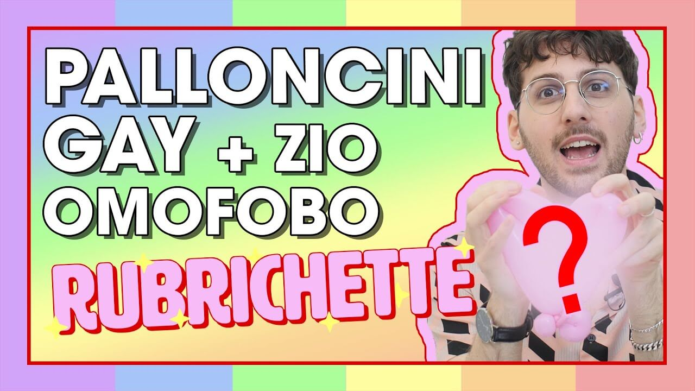

---
tags:
  - puntata
  - speciale-pride
  - barzellette
  - omofobia
  - fai-da-te
  - lavoretti
  - "#topo-gigio"
  - "#pippo-franco"
  - "#valentina-persia"
  - "#jerry-calà"
numero: "015"
data: 2020-06-19
link: https://youtu.be/Lb8oMiFgIqU
durata: 10:29
title: Puntata 015 - I palloncini sono GAY!? BARZELLETTE + rispondo a mio ZIO OMOFOBO
---
# I palloncini sono GAY!? BARZELLETTE + rispondo a mio ZIO OMOFOBO

|                    |                                                   |
| ------------------ | ------------------------------------------------- |
| **Numero**         | 015                                               |
| **Data**           | 19/06/2020                                        |
| **Link**           | [Guarda su YouTube](https://youtu.be/Lb8oMiFgIqU) |
| **Durata**         | 10:29                                             |
| Puntata Precedente | [[Puntata 014]]                                   |
| Puntata Successiva | [[Puntata 016]]                                   |

---
## Descrizione
> Benvenut* alla nuova puntata di [#Rubrichette](https://www.youtube.com/hashtag/rubrichette)✨!
> 
> L’unico show lgbt di youtube italia! (non controllare le fonti)
> 
> È finalmente il Pride Month e Rubrichette ti insegna a creare deliziose figure attraverso la secolare arte del palloncino! Insieme risponderemo alla domanda: “i palloncini sono gay?”.
> 
> Subito dopo una carrellata di barzellette omo-bi-transfobiche per ricordarci come certa gente rida per i motivi sbagliati.
> 
> Nel finale ti faccio un esempio di come rispondo a mio zio omofobo e razzista così avrai tutti gli strumenti per difenderti in futuro 🍴

---
## Benvenuti a Rubrichette…
> *"L'unico show che grazie modelli sulle confezioni di mutande ha tratto due conclusioni: 1. Di essere gay; 2: Di non poter mai raggiungere gli elevati standard fisici imposti dalla società dell'immagine"*

---
## Sigla

![[ep015.mp4]]

---
## Rubriche

### 1. Vuoi Scoppiarmi?
Un tentato tutorial di **balloon art** (scultura con i palloncini) in cui il conduttore prova a realizzare un cuore arcobaleno per celebrare il Pride Month, scontrandosi con la mancanza di strumenti adatti e la difficoltà della lavorazione.

![[Assets/rubriche/ep015/ep015_1.jpg]]

#### Collegamento
Essendo il Mese del Pride, Edoardo dichiara di volersi appropriare e riappropriare di una forma d'arte per troppi anni snobbata: l'arte del palloncionista.

![[Assets/screenshot/ep015/ep015_1.jpg]]
*Reference del tutorial seguito*

#### Riassunto del contenuto
###### L'imprevisto della pompetta
Dopo aver aperto la confezione di palloncini, Edoardo nota il simbolo della pompetta per il gonfiaggio, strumento di cui è sprovvisto. Racconta di essersi rivolto persino a una farmacista per trovare una soluzione rapida.

![[Assets/screenshot/ep015/ep015_2.jpg]]

![[Assets/screenshot/ep015/ep015_3.jpg]]
*La pompetta salvatrice*
###### Il tutorial e le difficoltà
Segue passo passo un video tutorial cercando di annodare e modellare il palloncino per formare le varie sezioni (le due palline, il "culetto" e la "salsiccetta").
###### Punti vendita e accessori
Durante le pause della lavorazione, propone di utilizzare i palloncini attorcigliati come #bijoux e gioielli da vendere ai mercatini a 30 euro, oppure come laccio emostatico.
###### Il risultato
Il conduttore si stanca e il risultato finale si rivela un completo fallimento che non somiglia affatto a un cuore, anche se viene comunque regalato simbolicamente al pubblico in chiusura.

![[Assets/screenshot/ep015/ep015_4.jpg]]
*Bellissimo cuore "con le palle"*

#### Menzioni speciali e Gergo tecnico
- **Menzioni speciali:** La **farmacista**, rimasta sorpresa dalla richiesta di un metodo per gonfiare palloncini.
- **Gergo tecnico:** Durante il tutorial le varie pieghe del palloncino vengono ribattezzate "culetto" e "salsiccetta", con la massima che per piegarlo bisogna "far vedere chi comanda".

---
### 2. Barzellette Omofobette
Una rassegna satirica e un'analisi critica di una serie di barzellette omofobe lette direttamente da un sito web per analizzarne gli stereotipi e la qualità comica.

![[Assets/rubriche/ep015/ep015_2.jpg]]
#### Collegamento
Conclusa la parentesi sulla _balloon art_, Edoardo introduce la rubrica spiegando di volersi occupare dell' "arte di offendere la comunità LGBT+" attraverso le barzellette, sottolineando con ironia il livello del sito poiché scritto interamente in _Comic Sans_.
#### Riassunto del contenuto
> Lo staff delle wiki non starà qui a riportare tutte le barzellette recitate in puntata. Per l'analisi e valutazione completa vedi l'articolo [[Barzellette Omofobette]].

###### Barzellette degne di nota:
- **Il falso test dell'HIV:** Un medico mente al paziente gay dicendogli che è positivo e gli prescrive di bere due litri di latte andato a male al sole con uova marce. La barzelletta viene definita "oscena" per l'abuso di potere, la mancanza di professionalità e gli stereotipi, ricevendo un voto pari a -1 Pippo Franco su 5 (ovvero un  Jerry Calà).
- **I tre bar di Milano:** Un ragazzo prova a scurire la sua voce squillante per farsi servire una birra ed evitare i baristi omofobi, per poi scoprire che anche l'ultimo barista è gay. Viene considerata una barzelletta "costruttiva" perché esorta i gay a non cambiare la propria voce ma a trovare il locale giusto.

#### Scala di valutazione
Per misurare la scarsa qualità della barzelletta del medico, Edoardo usa come parametro di giudizio N Pippo Franco su 5 Pippo Franco (lasciando aperta la possibilità di valutazioni in negativo).

---
### 3. Breve Storia Triste: Lo zio problematico
Una guida di sopravvivenza ai pranzi di famiglia, pensata per spiegare come affrontare i parenti discriminatori quando raccontano barzellette omofobe.

![[Assets/rubriche/ep015/ep015_3.jpg]]
#### Collegamento
Viene introdotta subito dopo la lettura delle barzellette dal sito web, ponendosi la domanda pratica: *"Come togliersi d'impiccio quando ci viene raccontata una barzelletta omofoba?"*.
#### Riassunto del contenuto
- **Lo scenario:** Un classico pranzo di famiglia in cui ci si trova seduti di fronte allo "Zio Antonio".
- **Le uscite dello zio:** Tra il primo e il secondo piatto, lo zio esordisce con la bocca mezza piena sparando considerazioni sessiste, frasi fasciste e barzellette sgradevoli (es. _"Qual è il colmo per un gay cinese? Morire per un male incurabile"_) tra l'omertà generale dei presenti.
- **Le due opzioni di risposta:**
	1. Subire in silenzio e andare ad aiutare la mamma e la zia a sparecchiare, lasciando risuonare nell'aria le frasi omofobe.
	2. Ricordarsi del problema di pressione alta dello zio e, posizionando bene le proprie opinioni con l'aiuto di una **forchetta**, farlo schizzare fino alla stratosfera per la spinta propulsiva del suo stesso sangue, consentendogli da lassù di vedere e capire finalmente il mondo.
- **Conclusione:** La pressione alta dello zio viene definita un'alleata *"almeno finché non avremo una legge contro l'omobitransfobia"*.

![[ep015_5.jpg]]
*Il caro zio Anotnio*

---
## Cliffhanger finale
> *"Noi ci vediamo sempre qui settimana prossima per scoprire assieme se a Topo Gigio piace di più il formaggio o aspettare i bambini fuori da scuola"*

![[fine.jpg]]
